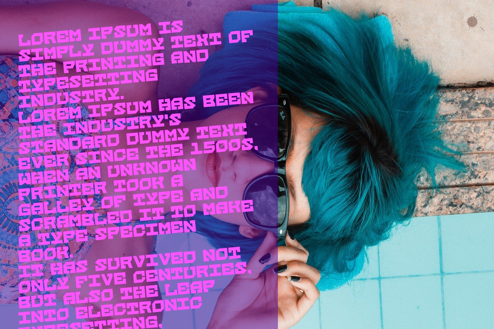

# Text and Image for PHP

[](https://opensource.org/licenses/MIT)
[](https://www.php.net/)

## 🚀 Пример


**Text and Image** — это простая и удобная PHP-библиотека для создания изображений с текстом. Она позволяет легко накладывать текст на цветной фон или на фоновое изображение, настраивать шрифты TrueType (.ttf), размеры, цвета, выравнивание и многое другое.

## 🚀 Возможности

-   **Простота использования**: Интуитивно понятный API.
-   **Работа с текстом**: Автоматический перенос слов и строк.
-   **Настройка шрифтов**: Поддержка встроенных шрифтов GD и любых `.ttf` файлов.
-   **Гибкая настройка**: Управление размером, цветом (HEX/RGBA), углом наклона текста.
-   **Выравнивание**: Горизонтальное (лево, центр, право) и вертикальное (верх, центр, низ) выравнивание текста.
-   **Фон**: Использование сплошного цвета или фонового изображения.
-   **Цепочки методов (Method Chaining)**: Создавайте изображения с помощью элегантного синтаксиса.
-   **Эффекты**: Применяйте простые фильтры, такие как оттенки серого или яркость.
-   **Разные форматы вывода**: Сохранение в `PNG`, `JPG`, `GIF` или вывод напрямую в браузер.

## 📦 Установка

Рекомендуемый способ установки — через [Composer](https://getcomposer.org/).

```bash
composer require igoradmtg/text_and_image
```

Убедитесь, что на вашем сервере включены расширения PHP `ext-gd` и `ext-mbstring`.

## ▶️ Быстрый старт

Вот простой пример, как создать изображение и сохранить его в файл.

```php
<?php
// Подключаем автозагрузчик Composer
require 'vendor/autoload.php';

// Импортируем класс
use Igoramdtg\TextAndImage\TextImage;

// Текст, который мы хотим нанести на изображение
$text = "Привет, мир! Это простой пример использования библиотеки TextAndImage. " .
        "Она автоматически переносит длинные строки, чтобы они уместились в заданную ширину.";

try {
    // Создаем экземпляр класса
    $image = new TextImage($text);

    // Настраиваем изображение (можно использовать цепочку методов)
    $image->setFont(__DIR__ . '/assets/Vetrino.ttf') // Укажите путь к вашему .ttf файлу
          ->setFontSize(24)
          ->setBackgroundColor('#34495e')
          ->setTextColor('#ffffff')
          ->setAlignment(TextImage::ALIGN_CENTER, TextImage::VALIGN_MIDDLE);

    // Сохраняем результат
    $image->save(__DIR__ . '/output/hello_world.png');

    echo "Изображение успешно создано: hello_world.png";

} catch (Exception $e) {
    // Обработка ошибок
    echo 'Ошибка: ' . $e->getMessage();
}

```

Результат:


## 📖 Примеры использования

### Пример 1: Использование фонового изображения

Вы можете легко использовать любое изображение в качестве фона.

```php
<?php
require 'vendor/autoload.php';
use Igoramdtg\TextAndImage\TextImage;

$text = "Текст поверх красивого фона";

$image = new TextImage($text);
$image->background_image = __DIR__ . '/assets/background.jpg'; // Путь к фону
$image->text_color = '#FFFFFF';
$image->text_size = 40;
$image->padding = 50;
$image->align = TextImage::ALIGN_RIGHT;
$image->valign = TextImage::VALIGN_BOTTOM;

// Применяем эффект для лучшей читаемости текста
$image->applyBrightness(-50); 

$image->save(__DIR__ . '/output/background_example.jpg', 'jpg');

echo "Изображение с фоном создано!";
```

### Пример 2: Настройка цветов и прозрачности

Цвета можно задавать как в формате HEX (`#RRGGBB` или `#RRGGBBAA` для прозрачности), так и в виде массива RGBA.

```php
<?php
require 'vendor/autoload.php';
use Igoramdtg\TextAndImage\TextImage;

$image = new TextImage("Прозрачность — это просто!");

// Установка полупрозрачного синего фона
$image->background_color = '#2980b9AA'; // HEX с альфа-каналом

// Установка цвета текста через массив RGBA
// Последнее значение (0-127) - это альфа-канал в GD (0=непрозрачный)
$image->text_color = [255, 255, 255, 0]; 

$image->setAlignment(TextImage::ALIGN_CENTER, TextImage::VALIGN_MIDDLE);
$image->save(__DIR__ . '/output/transparency_example.png');

echo "Изображение с прозрачностью создано!";
```

## ⚙️ Справочник API (основные свойства)

Все эти свойства являются `public` и могут быть изменены напрямую.

- `width` (int): Ширина изображения в пикселях. По умолчанию `720`.
- `font` (string): Путь к файлу шрифта `.ttf`.
- `text_size` (int): Размер шрифта. По умолчанию `17`.
- `padding` (int): Внутренние отступы. По умолчанию `30`.
- `line_height` (int|string): Высота строки. По умолчанию `'auto'`.
- `background_color` (string|array): Цвет фона.
- `text_color` (string|array): Цвет текста.
- `background_image` (string): Путь к фоновому изображению.
- `align` (string): Горизонтальное выравнивание (`left`, `center`, `right`).
- `valign` (string): Вертикальное выравнивание (`top`, `middle`, `bottom`).
- `angle` (int): Угол наклона текста.

### Основные методы

- `__construct(string $text)`: Создает новый объект.
- `setText(string $text)`: Устанавливает текст.
- `setTextColor(string|array $color)`: Устанавливает цвет текста.
- `setBackgroundColor(string|array $color)`: Устанавливает цвет фона.
- `setFont(string $path)`: Устанавливает шрифт.
- `setFontSize(int $size)`: Устанавливает размер шрифта.
- `setAlignment(string $align, string $valign)`: Устанавливает выравнивание.
- `applyGrayscale()`: Применяет фильтр "оттенки серого".
- `applyBrightness(int $level)`: Изменяет яркость (`-255` до `255`).
- `save(string $path, string $type = 'png', int $quality = 90)`: Сохраняет изображение в файл.
- `output(string $type = 'png', int $quality = 90)`: Выводит изображение в браузер.

## 📜 Лицензия

Этот проект распространяется под лицензией MIT. Подробности смотрите в файле `LICENSE`.
